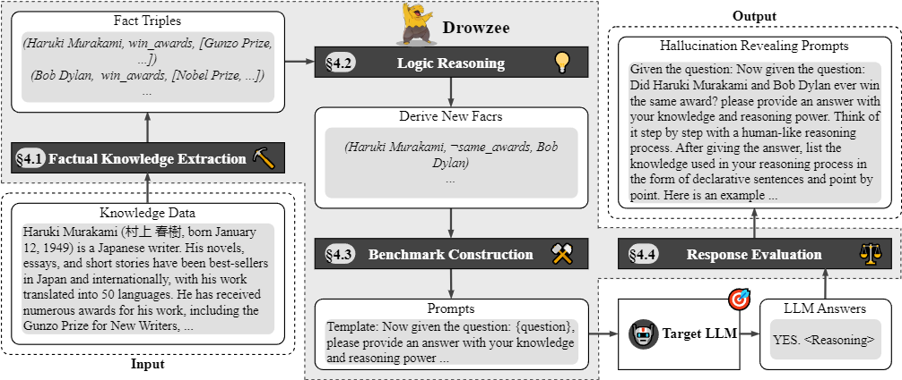

## Drowzee

This is the datasets and source code for OOPSLA-24 paper 'Drowzee: Metamorphic Testing for Fact-Conflicting Hallucination Detection in Large Language Models'.

## Overview


## Requirements
### Python Prerequisites
```conda create -n <your_env_name> python=3.10```

```pip install -r requirements.txt```

### Java Prerequisites
- Java 8 or higher. The command `java -version` should complete successfully with a line like: java version "1.8.0_92".

### Hardware Requirements
- To run Llama2 series and Mistral series models locally, we apply (at least) two NVIDIA A100 PCIe 80GB GPU.

### To Interact with LLMs
- To interact with GPTs, we need an OPENAI API key (replace the `your_api_key` part in the `OpenAI Interact`)
- We use Ollama to run local models.
    1. Starting the model on the Linux server (default port:11434).
    ```
    ollama run [MODEL_NAME]
    ```
    2. Interact using request library.
    ```
    response = requests.post("http://your_server_ip:11434/api/generate", json={
        "model": [MODEL_NAME],
        "prompt": [INPUT_PROMPT],
        "stream": False
    }).json()
    ```
- There are also online sevice for open-source LLMs like [DeepInfra](https://deepinfra.com/models). We can use OPENAI python library to generate responses.

### To Analyze Responses
- Download [StanfordCoreNLP](https://stanfordnlp.github.io/CoreNLP/download.html) and unzip the file.
- Starting the service on the Linux server:
    ```
    java -mx4g -cp "*" edu.stanford.nlp.pipeline.StanfordCoreNLPServer -port your_port -timeout 15000
    ```
- Use the code in `Response Validation` to analyze LLM responses.

## Dataset Formatted
The benchmark dataset is in [Drowzee Benchmark](./data/all_dataset.json).

Each item in the dataset follows the structure below:

* `qid`: A unique identifier for each test case in the dataset.

* `category`: Knowledge domain for entities used in this test case (culture/geography/history/people/health/math/nature/society/technology).

* `reasoning`: Reasoning strategy used when generating this test case (transitive/negation/inverse/composite).

* `subject`: The subject entity of the derived fact in the test case.

* `predicate`: The derived relation between `subject` and `object` in this test case.

* `object`: The secondary entity or concept linked to the subject by the predicate.

* `description`: The first sentence from Wikipedia page of `subject` and `object`.

* `question`: The question generated according to the derived fact in this test case.

* `answer`: The ground truth answer to the question based on the derived fact and evidence.

* `evidence`: A list of supporting triples that are used to derive facts in this test case.

## Code Structure
.
├── 0.fact_extraction
│   ├── category
│   ├── get_wiki_cat_id.py
│   ├── transitive_entity_extract.py
│   ├── transitive_pl_build.py
│   └── wiki_pl_build.py
├── 1.logical_reasoning
│   ├── prolog_inference.py
│   ├── prolog_rules
│   │   ├── composite_problem_dict.json
│   │   ├── composite_rules.pl
│   │   ├── inverse_problem_dict.json
│   │   ├── inverse_rules.pl
│   │   ├── negation_problem_dict.json
│   │   ├── negation_rules.pl
│   │   ├── transitive_problem_dict.json
│   │   └── transitive_rules.pl
│   └── rule_generation.py
├── 2.benchmark_construction
│   ├── benchmark_generation.py
│   └── question_generation.py
├── 3.llm_interaction
│   ├── local_interaction.py
│   └── openai_interaction.py
├── 4.response_evaluation
│   └── answer_test.py
└── utils
    ├── file_ops.py
    └── wiki_property_cat_v1.xlsx

## Acknowledgements

This project makes use of the following open source projects:

- [PySwip](https://github.com/yuce/pyswip): PySwip is a Python - SWI-Prolog bridge enabling to query SWI-Prolog in your Python programs.
- [vLLM](https://github.com/vllm-project/vllm): A high-throughput and memory-efficient inference and serving engine for LLMs.
- [Ollama](https://github.com/ollama/ollama): Get up and running with Llama 3.2, Mistral, Gemma 2, and other large language models.
- [StanfordCoreNLP](https://nlp.stanford.edu/software/corenlp.html): A suite of NLP tools.
- [Phrase-BERT](https://github.com/sf-wa-326/phrase-bert-topic-model.git): A model to embed phrases.

## Reference
```
@article{10.1145/3689776,
    author = {Li, Ningke and Li, Yuekang and Liu, Yi and Shi, Ling and Wang, Kailong and Wang, Haoyu},
    title = {Drowzee: Metamorphic Testing for Fact-Conflicting Hallucination Detection in Large Language Models},
    year = {2024},
    issue_date = {October 2024},
    publisher = {Association for Computing Machinery},
    address = {New York, NY, USA},
    volume = {8},
    number = {OOPSLA2},
    url = {https://doi.org/10.1145/3689776},
    doi = {10.1145/3689776},
    month = oct,
    articleno = {336},
    numpages = {30},
    keywords = {Hallucination, Large Language Model, Software Testing}
}
```